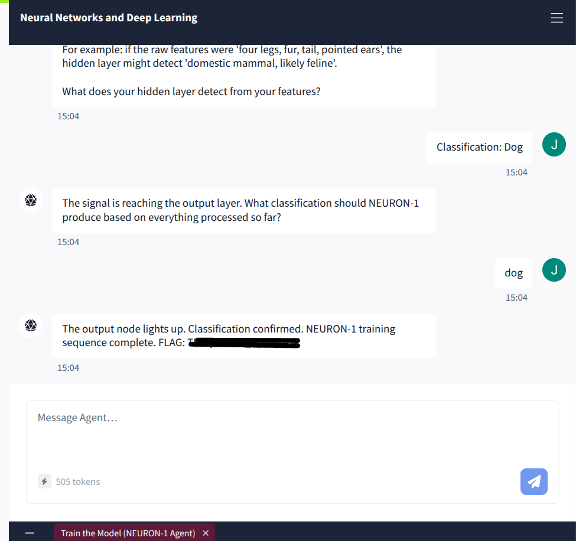
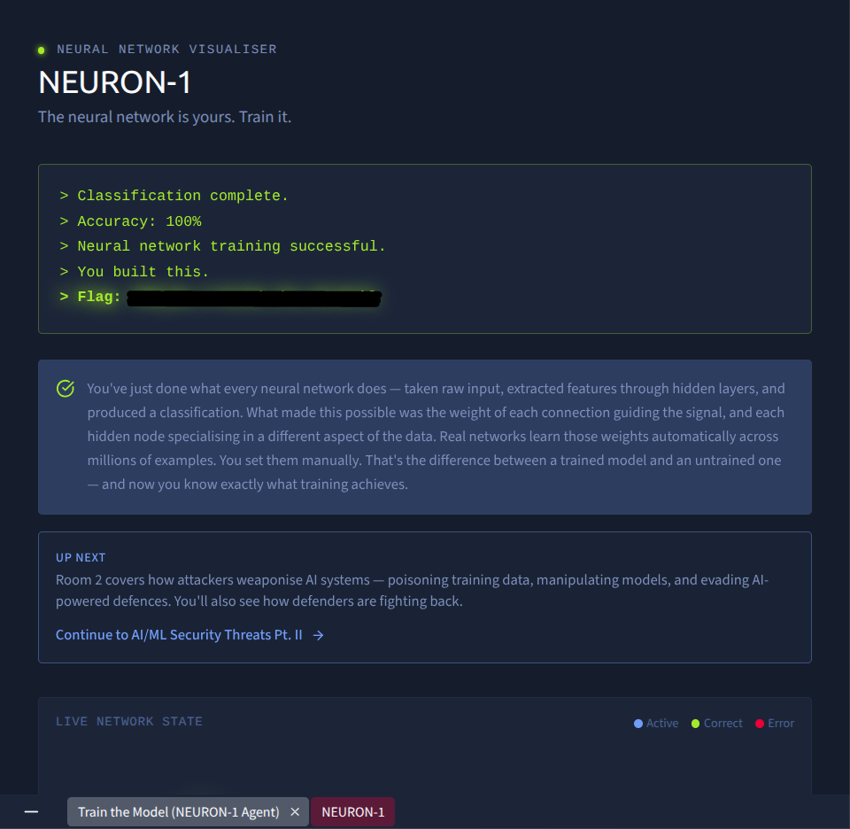

# 🧩 The Building Blocks of AI: Machine Learning, Neural Networks & Transformer Architectures

A technical retrospective and lab walkthrough covering machine learning paradigms, neural network mechanics, transformer architectures, and interactive model training completed through TryHackMe's AI Security pathway.

---

## 📌 Executive Summary

Before evaluating adversarial vectors—such as prompt injection, model inversion, or training data poisoning—security professionals must understand how machine learning systems process data and construct predictions. This document breaks down:
1. The structural hierarchy connecting **Artificial Intelligence**, **Machine Learning**, **Deep Learning**, and **Large Language Models**.
2. The fundamental mathematical loop: **Decision Process**, **Error Function (Loss)**, and **Model Optimization (Backpropagation)**.
3. The four primary **learning paradigms** and their real-world cybersecurity applications.
4. The structural shift from biological neural networks to **Self-Attention Transformer models**.
5. Practical simulation and manual layer-by-layer classification using TryHackMe's **NEURON-1 agent**.

---

## 🏗️ The AI Architecture Hierarchy

Modern artificial intelligence is organized into nested technical domains, each introducing greater abstraction and data autonomy:

*Figure 1: Conceptual hierarchy illustrating the progression from foundational AI down to Large Language Models.*

* **Artificial Intelligence (AI):** The broad discipline of engineering machines capable of simulating human cognitive decision-making.
* **Machine Learning (ML):** Algorithmic systems that learn statistical patterns from datasets without rigid procedural programming.
* **Deep Learning (DL):** Multi-layered artificial neural networks capable of autonomous, scalable feature extraction from unstructured data.
* **Generative AI & LLMs:** Transformer-based architectures trained on vast token corpora to generate novel natural language and complex artifacts.

---

## ⚙️ Core Mechanics: The Optimization Loop

Every machine learning model operates on an iterative mathematical feedback loop:
1. **Decision Process:** Ingests input features to formulate a preliminary prediction or score.
2. **Error Function (Loss):** Quantifies variance between the prediction and ground-truth validation data.
3. **Model Optimization:** Updates connection weights and bias parameters via backpropagation and gradient descent to minimize error across subsequent iterations.

### The 4 Machine Learning Paradigms in Cybersecurity

| Paradigm | Training Structure | Core Function | Practical Security Application |
| :--- | :--- | :--- | :--- |
| **Supervised Learning** | Labeled datasets (Feature $\rightarrow$ Label) | Maps input features to explicit outputs | Phishing email classification, malware signature detection |
| **Unsupervised Learning** | Unlabeled raw datasets | Identifies intrinsic clusters and structural patterns | Network baseline deviation, anomaly detection (UEBA) |
| **Semi-Supervised Learning** | Sparse labels + large unlabeled pool | Uses minimal labels to guide bulk clustering | Large-scale threat intelligence and artifact categorization |
| **Reinforcement Learning** | Dynamic agent-environment loop | Maximizes cumulative reward over penalties | Automated penetration pathfinding, dynamic defense simulation |

---

## 🧠 Transformers & The Attention Mechanism

Traditional Recurrent Neural Networks (RNNs) analyzed text sequentially, introducing compute bottlenecks and struggling with long-range dependencies. Introduced in Google's 2017 paper *Attention Is All You Need*, the **Transformer architecture** replaced recurrence with **Self-Attention Mechanisms**:

*Figure 2: Next-token prediction mechanics and parallelized attention context mapping.*

* **Parallel Token Processing:** Enables simultaneous processing of entire token windows across modern GPU hardware.
* **Self-Attention Scoring:** Computes the mathematical relationship between all tokens in a prompt simultaneously, allowing models to resolve ambiguous context and pronoun references (e.g., distinguishing between entity references across long passages).
* **Pre-Training & RLHF:** Following large-scale pre-training across trillions of parameters, **Reinforcement Learning from Human Feedback (RLHF)** aligns the model, shaping raw next-token predictors into focused, conversational agents.

---

## 🔬 Practical Lab Implementation: NEURON-1 Simulation

### 1. Conversational Layer Walkthrough (NEURON-1 Agent)
Engaged directly with the interactive NEURON-1 agent to trace how raw input data traverses a forward pass:
* **Input Layer:** Ingested feature descriptions (physical characteristics and token markers).
* **Hidden Layer:** Processed combined features into abstract pattern representations (canine / mammal indicators).
* **Output Layer:** Confirmed probability distribution and triggered the final classification.

*Figure 3: Interactive layer-by-layer forward pass and classification verification using NEURON-1.*

---

### 2. Neural Network Topology & Weight Activation
Manually calibrated hidden layer activations to optimize edge and vertical feature detection, validating node convergence for digit recognition:

*Figure 4: Topology visualizer showing active synaptic connections, hidden layer routing, and final node selection.*

---

### 3. Classification Verification & Completion
Successfully executed the forward pass sequence, achieving 100% accuracy and capturing the training verification flag:

*Figure 5: Terminal validation confirming 100% classification accuracy and training completion.*

---

## 🛡️ Security Engineering Takeaways

Understanding underlying model mechanics exposes the primary attack surfaces of modern AI pipelines:
* **Probabilistic Fragility:** Because LLMs are non-deterministic next-token predictors rather than rule-based engines, traditional regex or string-matching sanitization is insufficient to prevent jailbreaks.
* **Adversarial Exploitation Vectors:**
  * **Data Poisoning:** Corrupting training or fine-tuning datasets shifts optimization weights, injecting persistent backdoors.
  * **Prompt Injections:** Exploiting tokenization and attention boundaries forces models to prioritize untrusted user input over system instructions.
  * **Model Inversion & Exfiltration:** Querying decision boundaries allows attackers to reconstruct training records or infer underlying architecture.

Mastering these building blocks provides the foundation required to assess systems against the **OWASP Top 10 for LLMs**.

---

## 🔗 Next Steps
With foundational AI architecture and neural network mechanics documented, the next write-up examines practical adversarial exploit vectors and prompt injection defenses.

